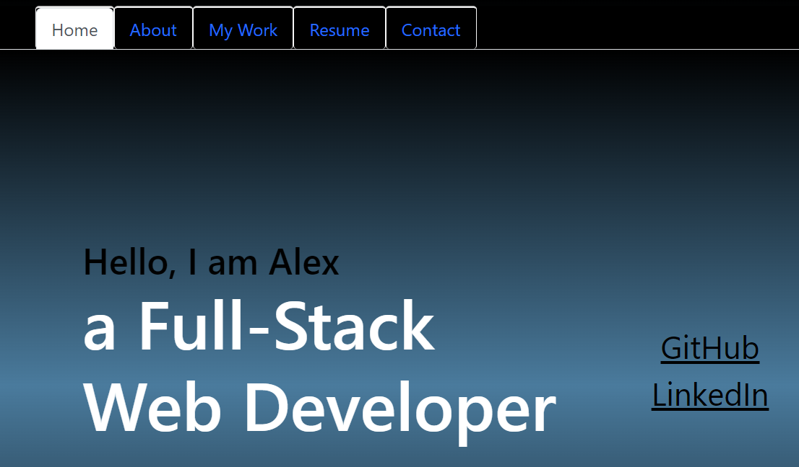

# react-portfolio
  by allstarcoding777
  
  * ## Description
  This interactive webpage contains my portfolio that was created using React.
  * ## Usage
  When a user loads the portfolio, they are presented with icon links to the developer’s GitHub and LinkedIn profiles. They are also able to navigate to the links in the navbar for additional information.
  
  

  * ## Deployed Application
  https://6435859b1c2e0503515bbd5d--creative-kangaroo-aa2b20.netlify.app/
  
  * ## License
  This project is licensed under the MIT license.